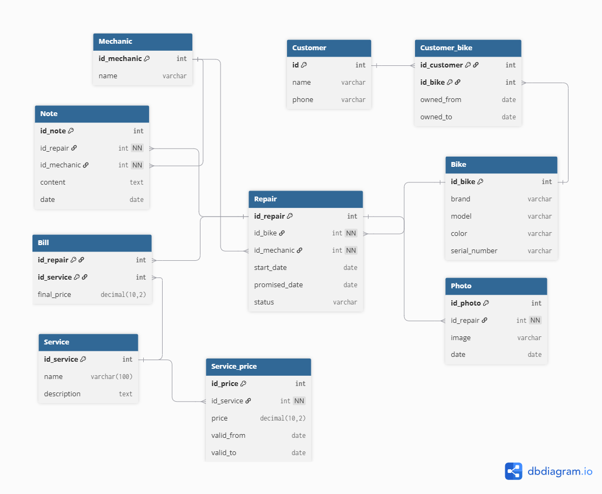

## Image
[](domain-model.png)

## Code
```
Table Customer {
  id int [pk]
  name varchar
  phone varchar
}

Table Mechanic {
  id_mechanic int [pk]
  name varchar
}

Table Bike {
  id_bike int [pk]
  brand varchar
  model varchar
  color varchar
  serial_number varchar
}

Table Customer_bike {
  id_customer int [pk, ref: > Customer.id]
  id_bike int [pk, ref: > Bike.id_bike]
  owned_from date
  owned_to date
}

Table Repair {
  id_repair int [pk]
  id_bike int [not null, ref: > Bike.id_bike]
  id_mechanic int [not null, ref: > Mechanic.id_mechanic]
  start_date date
  promised_date date
  status varchar
}

Table Note {
  id_note int [pk]
  id_repair int [not null, ref: > Repair.id_repair]
  id_mechanic int [not null, ref: > Mechanic.id_mechanic]
  content text
  date date
}

Table Photo {
  id_photo int [pk]
  id_repair int [not null, ref: > Repair.id_repair]
  image varchar
  date date
}

Table Service {
  id_service int [pk]
  name varchar(100)
  description text
}

Table Service_price {
  id_price int [pk]
  id_service int [not null, ref: > Service.id_service]
  price decimal(10,2)
  valid_from date
  valid_to date
}

Table Bill {
  id_repair int [pk, ref: > Repair.id_repair]
  id_service int [pk, ref: > Service.id_service]
  final_price decimal(10,2)
} 
```


## Lifecycle
- Status:
    Received
    Diagnosing
    Waiting for approval
    Approved
    Rejected
    In repair
    Ready
    Picked up

- Allowed transitions
    Received → Diagnosing
    Diagnosing → Waiting for approval
    Waiting for approval → Approved
    Waiting for approval → Rejected
    Approved → In repair
    In repair → Ready
    Ready → Picked up
    Rejected → Picked up

- Not allowed transitions
    Rejected → In repair
    And none that comes before itself

## Table
| Entity | User story that requires it |
| Customer | 3 |
| Mechanic | 12 |
| Bike | 4 |
| Customer_bike | 8 |
| Repair | 1, 5, 6, 11, 13, 16 |
| Note | 10 |
| Photo | 9 |
| Service | 2 |
| Service_price |14, 15 |
| Repair_service | 1, 7 |


## The thing and the copy of the thing
Each bicycle is represented as a separate entity with its own id_bike and serial_number, even when two bicycles have the same brand, model, and color. 
The Customer_bike table records which customer owns each bicycle and the period of ownership, while repairs are associated directly with the bicycle through id_bike. 
This prevents the mix-up described by the owner because two similar bicycles can still be uniquely identified and their repair histories remain attached to the correct bicycle. 
A single table with a quantity column would only tell us that there are, for example, two blue Trek Marlins, but it could not tell us which specific bicycle has a particular serial number, who owns it, or which repair history belongs to each bicycle.

## Derived, or stored? 
The total cost of a repair is deliberately not stored as a separate column because it can be derived by adding the final_price values of the services associated with that repair through Repair_service. In contrast, final_price is stored even though it may appear derivable from the service price, because the shop sometimes charges less than the standard price. If final_price were not stored, changing the standard price in the future would make it impossible to know how much the customer was actually charged for an old repair.