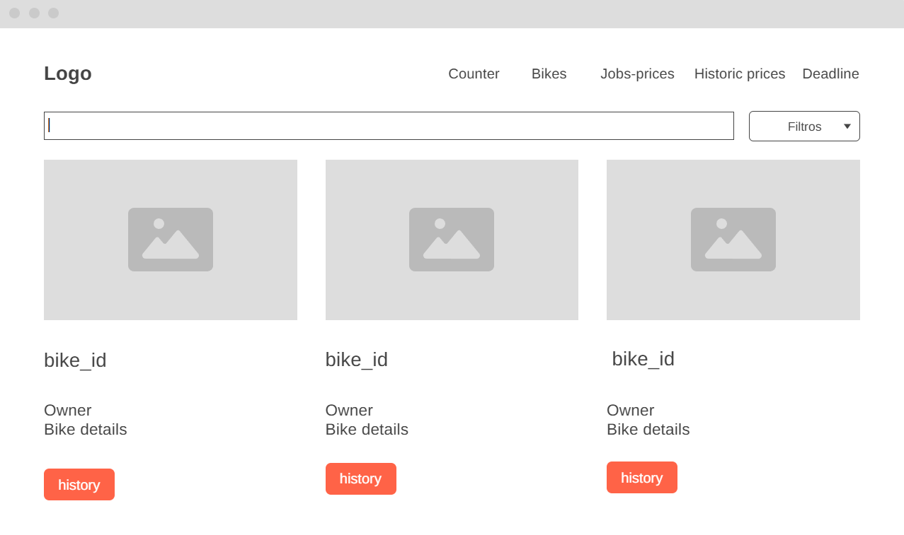
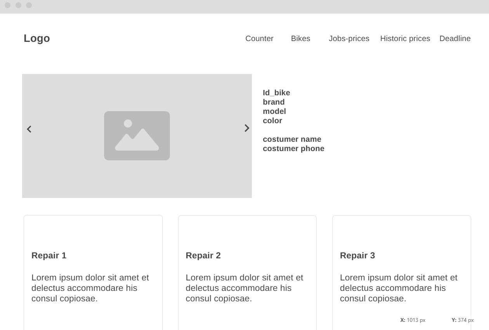
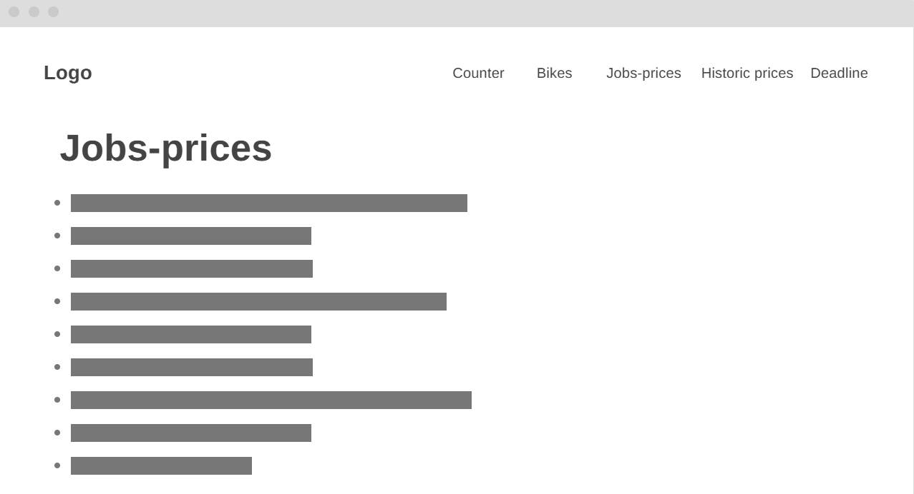
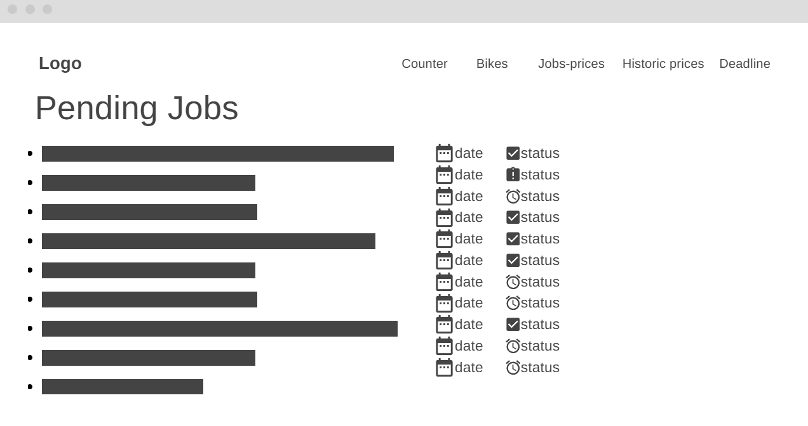

## Counter
This view displays general information about each bike—such as its ID, photos, owner details, relevant specifics, and repair history—and clicking on it leads to the "bikes" view.

## Mechanic
This view allows you to see a breakdown of all bike information, past work, and ownership history.

## Costumer
This view allows you to see the list of jobs along with their prices.

## Owner
This view allows you to see the deadlines for the following tasks.
